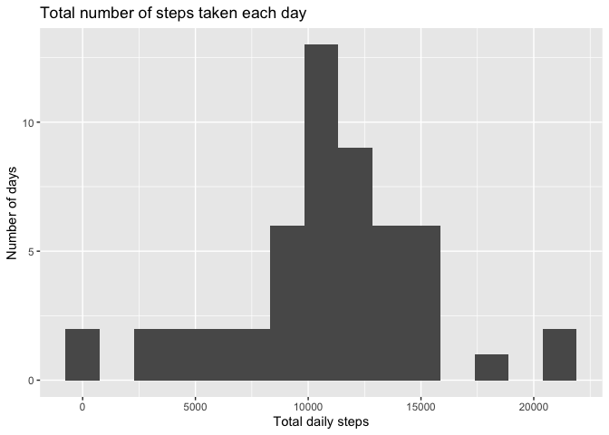
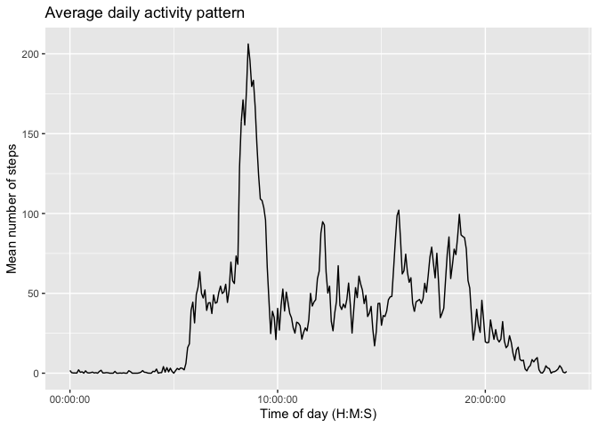
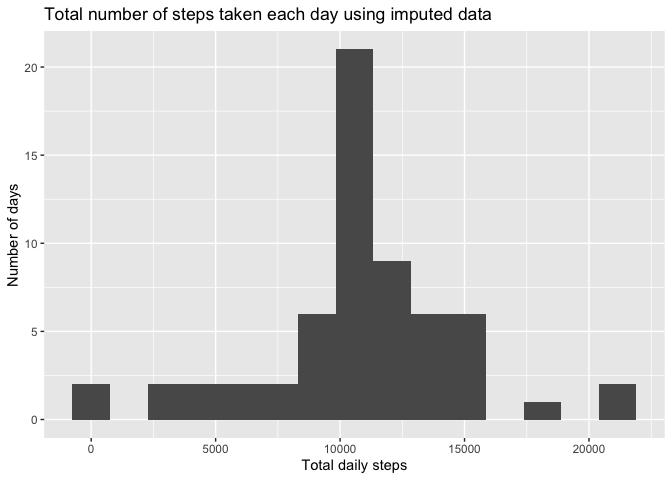
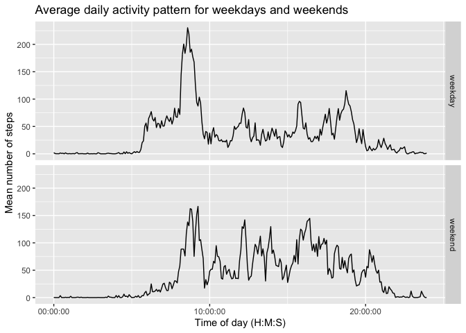

## Loading and preprocessing the data


```r
library(tidyverse)
library(lubridate)
library(ggplot2)
```

The data file "activity.zip" is loaded from the working directory. The *date* variable is converted to date class. The *interval* variable is first padded with leading 0s, then a colon is inserted, and then it is converted to period class (time).

```r
activity <- read_csv("activity.zip")

activity$date <- ymd(activity$date)

activity$interval <- str_pad(activity$interval,
                             width=4,
                             side="left",
                             pad="0")

str_sub(activity$interval, 3, 2) <- ":"

activity$interval <- hm(activity$interval)
```

## What is the mean total number of steps taken per day?

First, the *activity* data frame is grouped by date and the total number of steps is summed for each day. Second, the number of steps taken each day is plotted as a histogram.

```r
daily_steps <- activity %>%
               group_by(date) %>%
               summarise(total_steps = sum(steps, na.rm = FALSE),
                         n = n(),
                         prop_na = mean(is.na(steps)))

p1 <- ggplot(daily_steps, aes(x = total_steps)) +
      geom_histogram(bins = 15) +
      labs(x = "Total daily steps",
           y = "Number of days",
           title = "Total number of steps taken each day")
p1
```

<!-- -->

Here, the mean and median numbers of daily steps are calculated.

```r
step_summary <- summary(daily_steps$total_steps, na.rm = TRUE)

step_summary
```

```
##    Min. 1st Qu.  Median    Mean 3rd Qu.    Max.    NA's 
##      41    8841   10765   10766   13294   21194       8
```
-   The mean total number of steps taken is 10766
-   The median total number of steps taken is 10765

## What is the average daily activity pattern?

To determine the average daily activity pattern, the *activity* data frame is grouped by *interval*, then the mean of *steps* is calculated. The resulting average step counts are plotted as a time series over a day.

```r
interval_steps <- activity %>%
                  group_by(interval) %>%
                  summarise(avg_steps = mean(steps, na.rm = TRUE))

p2 <- ggplot(interval_steps, aes(x = interval, y = avg_steps)) +
      geom_line() +
      scale_x_time() +
      labs(x = "Time of day (H:M:S)",
           y = "Mean number of steps",
           title = "Average daily activity pattern")
p2
```

<!-- -->

Here, the  five minute interval containing the maximum average number of steps is determined.

```r
max_avg_int <- interval_steps$interval[which.max(interval_steps$avg_steps)]
```
-   The 5-minute interval that, on average, contains the maximum number of steps occurs at 8:35

## Imputing missing values


```r
num_missing <- sum(is.na(activity$steps))
```
-   The total number of missing observations in the data set is 2304

Missing values are replaced with the average number of steps for a given interval. Replacement values are taken from the *avg_steps* variable in the *interval_steps* data frame and imputed using dplyr::coalesce().

```r
activity_com <- activity %>%
                group_by(date) %>%
                mutate(steps = coalesce(steps, interval_steps$avg_steps))
```

Re-plotting the histogram of the total number of steps taken each day using the new data without missing values.

```r
daily_steps_com <- activity_com %>%
                   group_by(date) %>%
                   summarise(total_steps = sum(steps, na.rm = FALSE))

p3 <- ggplot(daily_steps_com, aes(x = total_steps)) +
      geom_histogram(bins = 15) +
      labs(x = "Total daily steps",
           y = "Number of days",
           title = "Total number of steps taken each day using imputed data")
p3
```

<!-- -->

Here, the mean and median number of daily steps are re-calculated using the data without missing values.

```r
step_summary_com <- summary(daily_steps_com$total_steps, na.rm = TRUE)

step_summary_com
```

```
##    Min. 1st Qu.  Median    Mean 3rd Qu.    Max. 
##      41    9819   10766   10766   12811   21194
```
-   After imputing missing values, the mean total number of steps taken is 10766
-   Previously, the mean was 10766
-   After imputing missing values, the median total number of steps taken is 10766
-   Previously, the median was 10765

Imputing missing data with the mean has not changed the mean number of total steps. However, the quartiles, including the median, have shifted. In this case the median number of total steps taken increased by only one step. The primary effect of imputing missing values has been to increase the frequency of days on which the average number of steps were taken. This is evident as the higher central peak in the histogram. 

## Are there differences in activity patterns between weekdays and weekends?

Here, a new factor variable *day_ty* in the *activity_com* data frame is created. Its two levels, “weekday” and “weekend”, indicate whether a given date is a weekday or weekend day.

```r
activity_com <- activity_com %>%
                mutate(day_ty = case_when(wday(date) %in% c(1,7) ~ "weekend",
                                          wday(date) %in% c(2:6) ~ "weekday"))

activity_com$day_ty <- as_factor(activity_com$day_ty)
```

Re-plotting the average daily activity pattern time series using imputed data. Additionally, the plot is faceted by weekday vs weekend factor.

```r
interval_steps_com <- activity_com %>%
                      group_by(day_ty, interval) %>%
                      summarise(avg_steps = mean(steps))
```

```
## `summarise()` has grouped output by 'day_ty'. You can override using the
## `.groups` argument.
```

```r
p4 <- ggplot(interval_steps_com, aes(x = interval, y = avg_steps)) +
      geom_line() +
      facet_grid(day_ty ~ .) +
      scale_x_time() +
      labs(x = "Time of day (H:M:S)",
           y = "Mean number of steps",
           title = "Average daily activity pattern for weekdays and weekends")
p4
```

<!-- -->
